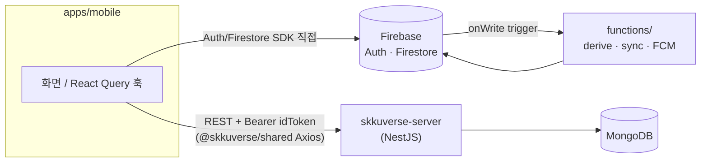
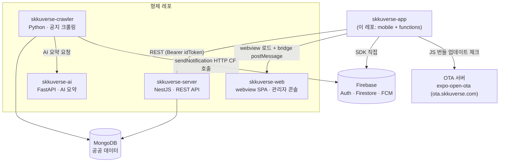

# Architecture Overview

> skkuverse-app의 중간 고도(mid-altitude) 아키텍처 설명 — 모노레포 경계, 데이터 흐름, 앱 구동 구조를 처음 파악하려는 개발자용. 세부 계약·수치는 각 SSOT 문서/코드를 가리킨다.

## 모노레포 경계

Yarn workspaces 모노레포. workspace는 `apps/*` + `packages/*` (루트 `package.json`), `functions/`는 workspace 밖의 독립 npm 패키지다.

| 워크스페이스 | 역할 | 의존 방향 |
| --- | --- | --- |
| `apps/mobile/` | Expo + React Native 모바일 앱 (iOS/Android). 메인 클라이언트 | `packages/*` 전부 소비 |
| `packages/shared/` | 데이터 레이어 — API 클라이언트(Axios), Zustand 스토어, React Query 훅, 타입, 디자인 토큰, i18n | 앱에 의존하지 않음 (하위 계층) |
| `packages/sds/` | Skku Design System 컴포넌트 라이브러리. `SDSProvider`로 테마 제공 | `shared`의 토큰 소비 |
| `packages/bridge/` | Web↔Native 메시지 패싱 계약 (`postToApp` / `parseWebMessage`) | 타입 SSOT. 발신 측(skkuverse-web)이 byte 단위로 vendoring하는 **레포 간 계약** |
| `functions/` | Firebase Cloud Functions — 클라이언트에 둘 수 없는 서버 로직 (FCM 발송, preferences derive/sync, 계정 삭제) | Firestore를 사이에 두고 앱과 간접 결합 |

의존은 항상 **apps → packages** 한 방향이다. packages끼리는 `sds → shared(tokens)`만 허용. 패키지 국소 지식은 각 워크스페이스 README에 있다 ([docs/README.md](../README.md) "워크스페이스 README" 표 참조).

## 데이터 흐름: 유저 데이터 vs 공공 데이터

저장소 원칙은 데이터 소유자 기준으로 갈린다.

- **유저 데이터** (인증, 알림 preferences, 디바이스 토큰, 북마크): **Firebase** — 앱이 Auth/Firestore SDK로 **직접** 읽고 쓴다. 서버 API를 거치지 않는다. 무결성은 `apps/mobile/firestore.rules`가 강제하고, 파생 상태(`subscribedTopics` 등)는 `functions/`의 Firestore trigger가 계산한다.
- **공공 데이터** (공지, 버스, 건물, 지도 config, SDUI 섹션): **skkuverse-server**(별도 레포, NestJS + MongoDB)의 REST API 경유. 인증은 Firebase `Bearer <idToken>`.



앱 쪽 진입점은 전부 `@skkuverse/shared`다 — Axios 클라이언트는 `Result<T>` (success/failure union)로 감싸고, React Query 훅(`useCampusSections`, `useTransitList`, `useBuildings` 등)이 화면에 공급한다.

## Provider Stack (app/_layout.tsx)

루트 레이아웃의 프로바이더 계층. 순서 자체가 제약이다.

```text
ErrorBoundary → GestureHandlerRootView → SafeAreaProvider → SDSProvider
  → QueryProvider → InitGate → BottomSheetModalProvider → Stack
```

- **ErrorBoundary** — 최외곽. 아래 모든 자식의 렌더 에러를 잡아야 하므로 가장 바깥.
- **GestureHandlerRootView** — `@gorhom/bottom-sheet` 등 gesture-handler 기반 컴포넌트의 필수 루트.
- **SafeAreaProvider** — 루트에서 insets 측정. 단, modal 라우트는 별도 native VC에 마운트되므로 **각 modal 화면 안에서 재마운트**가 필요하다 → [ios-modal-safe-area-provider.md](ios-modal-safe-area-provider.md).
- **SDSProvider** — 디자인 시스템 테마 + overlay. UI를 그리는 모든 하위 컴포넌트보다 위.
- **QueryProvider** — QueryClient가 어떤 쿼리보다도 먼저 존재해야 하므로 화면 트리보다 위.
- **InitGate** — auth 준비 전까지 네비게이션을 게이트 (스플래시 연동 → [splash-animation.md](splash-animation.md)).
- **BottomSheetModalProvider** — 바텀시트 포털. gesture 루트와 테마 안쪽, 화면 Stack 바로 바깥.
- **Stack** — Expo Router 루트 native stack.

## 탭 구조: per-tab nested Stack

`app/(tabs)/` 아래 4개 탭(`home/`, `campus/`, `transit/`, `notices/`)이 **각자 자기 `_layout.tsx`(Stack) + `index.tsx`(화면)** 를 가진다. 탭마다 독립 Stack을 두는 이유: 부모 Stack 하나가 헤더를 소유하면 탭 전환 시 `headerShown` 토글로 콘텐츠가 위아래로 슬라이드하는 layout shift가 생긴다. 헤더는 `react-native-screens` native-stack을 직접 사용하고, 공통 옵션은 `apps/mobile/src/lib/header-options.ts`에 있다.

상세(cold-start 라우팅, iOS long-press phantom 회피, iOS 26 NativeTabs 제약)는 루트 `CLAUDE.md`의 탭 구조 섹션과 [ios-26-native-tabs-minimize.md](ios-26-native-tabs-minimize.md) 참조.

## Server-Driven UI (SDUI)

홈/캠퍼스 화면의 섹션 구성은 코드가 아니라 **서버 config**가 결정한다. 앱은 config를 fetch해서 `apps/mobile/src/sdui/`의 위젯으로 렌더한다.

- `src/sdui/renderer.tsx` — 섹션 config → 위젯 매핑
- `src/sdui/widgets/` — Banner, ButtonGrid, Notice, SectionTitle 등 위젯 구현
- `src/sdui/action-handler.ts` — 'route' 등 서버 정의 액션 처리 (bare `/`는 phantom 회피 위해 가로챔)

server↔client 계약의 SSOT는 [../reference/sdui-campus-spec.md](../reference/sdui-campus-spec.md).

## 시스템 경계

앱을 둘러싼 전체 생태계. 형제 레포와의 결합점은 REST API·Firestore·HTTP endpoint, 그리고 webview 페이지 로드와 그 위의 `packages/bridge` 메시지 계약이다.



- **skkuverse-web**은 앱이 `/webview` 셸에서 로드하는 페이지를 배포한다 (`webview.skkuverse.com`). 그 페이지가 네이티브 브리지에 닿을 수 있는지는 **서버가 정한다** — `skkuverse-server`의 origin allowlist가 `GET /app/config`로 내려오고, 클라이언트는 메시지마다 fail-closed로 재확인한다.
- **skkuverse-crawler**가 공지를 수집해 MongoDB에 적재하고, 새 공지 발생 시 `functions/`의 `sendNotification` HTTP endpoint를 호출해 FCM 발송을 트리거한다.
- **skkuverse-ai**는 크롤링된 공지의 AI 요약을 생성한다 (crawler↔ai는 서버 인프라 내부 결합, 앱과 무관).
- **OTA 서버**는 JS-only 변경을 스토어 심사 없이 배포한다 → [../how-to/ota-update.md](../how-to/ota-update.md).

## 관련 문서

- [../reference/deep-link.md](../reference/deep-link.md) — 외부 진입 (커스텀 스킴 + 유니버셜 링크) 계약
- [../reference/sdui-campus-spec.md](../reference/sdui-campus-spec.md) — SDUI server↔client 계약
- [ios-26-native-tabs-minimize.md](ios-26-native-tabs-minimize.md) — 탭 화면 chain root rule (native 메커니즘)
- [../decisions/](../decisions/) — 구조적 결정의 ADR 모음
- [../README.md](../README.md) — 문서 인덱스 + 워크스페이스 README 목록
