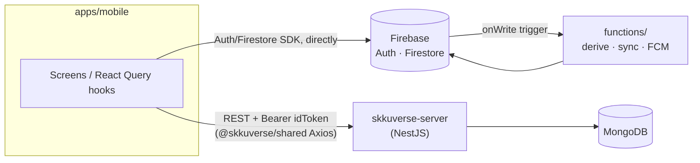
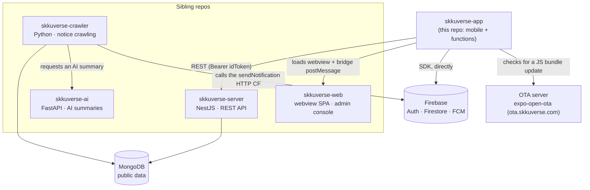

# Architecture Overview

> Where the monorepo boundaries sit, how data flows, and how the app is assembled, at mid altitude. Written for someone meeting the codebase for the first time. Detailed contracts and figures point at their own SSOT document or the code.

## Monorepo boundaries

A Yarn workspaces monorepo. The workspaces are `apps/*` and `packages/*`, declared in the
root `package.json`. `functions/` sits outside them as its own npm package.

| Workspace | Role | Direction of dependency |
| --- | --- | --- |
| `apps/mobile/` | The Expo and React Native app for iOS and Android, and the main client | Consumes all of `packages/*` |
| `packages/shared/` | The data layer. Holds the Axios API client, the Zustand stores, the React Query hooks, the shared types, the design tokens and i18n | Depends on nothing above it |
| `packages/sds/` | The Skku Design System component library, themed through `SDSProvider` | Consumes `shared`'s tokens |
| `packages/bridge/` | The web-to-native message contract (`postToApp`, `parseWebMessage`) | The type SSOT, and a **cross-repo contract**: skkuverse-web vendors it byte for byte |
| `functions/` | Firebase Cloud Functions, for server logic that cannot live on the client. Sends FCM and runs the preferences derive-and-sync chain. Account deletion lives here too | Coupled to the app only indirectly, through Firestore |

Dependencies always run **apps to packages**, one way. Between packages only
`sds → shared(tokens)` is allowed. Package-local knowledge lives in each workspace README;
see the workspace README table in [docs/README.md](../README.md).

## Data flow: user data against public data

Which store a piece of data belongs in follows from who owns it.

- **User data**, meaning auth, notification preferences, device tokens and bookmarks, lives
  in **Firebase**. The app reads and writes it **directly** through the Auth and Firestore
  SDKs, without a server API in between. Integrity is enforced by
  `apps/mobile/firestore.rules`, and derived state such as `subscribedTopics` is computed by
  a Firestore trigger in `functions/`.
- **Public data**, meaning notices, buses, buildings, map config and SDUI sections, arrives
  through the REST API of **skkuverse-server**, a separate repo running NestJS and MongoDB.
  Requests authenticate with a Firebase `Bearer <idToken>`.



Every entry point on the app side is `@skkuverse/shared`. The Axios client wraps responses in
`Result<T>`, a success-or-failure union, and React Query hooks such as `useCampusSections`,
`useTransitList` and `useBuildings` feed the screens.

## The provider stack (app/_layout.tsx)

The provider layers in the root layout. The order itself is a set of constraints.

```text
ErrorBoundary → GestureHandlerRootView → SafeAreaProvider → SDSProvider
  → QueryProvider → InitGate → BottomSheetModalProvider → Stack
```

- **ErrorBoundary** is outermost, because it has to catch render errors from every child
  below it.
- **GestureHandlerRootView** is the required root for gesture-handler components such as
  `@gorhom/bottom-sheet`.
- **SafeAreaProvider** measures insets at the root. A modal route mounts in its own native
  view controller, so it needs **its own provider inside the modal screen**. See
  [ios-modal-safe-area-provider.md](ios-modal-safe-area-provider.md).
- **SDSProvider** supplies the design system theme and overlays, so it sits above everything
  that draws UI.
- **QueryProvider** goes above the screen tree, because the QueryClient has to exist before
  any query does.
- **InitGate** holds navigation until auth is ready, working with the splash. See
  [splash-animation.md](splash-animation.md).
- **BottomSheetModalProvider** is the bottom sheet portal, inside the gesture root and the
  theme, and immediately outside the screen Stack.
- **Stack** is the Expo Router root native stack.

## Tab structure: a nested Stack per tab

The four tabs under `app/(tabs)/` — `home/`, `campus/`, `transit/` and `notices/` — each
have **their own `_layout.tsx` holding a Stack, plus an `index.tsx` holding the screen**.
Each tab gets an independent Stack for a reason: when one parent Stack owns the header,
switching tabs toggles `headerShown` and the content slides up and down, which is a visible
layout shift. Headers use the `react-native-screens` native stack directly, and the shared
options are in `apps/mobile/src/lib/header-options.ts`.

The details, covering cold-start routing, avoiding the iOS long-press phantom, and the iOS 26
NativeTabs constraint, are in the tab structure section of the root `CLAUDE.md` and in
[ios-26-native-tabs-minimize.md](ios-26-native-tabs-minimize.md).

## Server-Driven UI (SDUI)

The section layout of the home and campus screens is decided by **server config** rather than
by code. The app fetches the config and renders it with the widgets in
`apps/mobile/src/sdui/`.

- `src/sdui/renderer.tsx` maps a section config to a widget.
- `src/sdui/widgets/` holds the widget implementations: Banner, ButtonGrid, Notice,
  SectionTitle and the rest.
- `src/sdui/action-handler.ts` handles server-defined actions such as 'route', intercepting a
  bare `/` to avoid the phantom history entry.

The SSOT for the contract between server and client is
[../reference/sdui-campus-spec.md](../reference/sdui-campus-spec.md).

## System boundaries

The ecosystem around the app. What couples it to its sibling repos is the REST API, Firestore,
an HTTP endpoint, and the webview pages it loads along with the `packages/bridge` message
contract on top of them.



- **skkuverse-web** deploys the pages the app loads in its `/webview` shell, at
  `webview.skkuverse.com`. Whether such a page can reach the native bridge is **the server's
  decision**: skkuverse-server's origin allowlist arrives through `GET /app/config`, and the
  client re-checks it fail-closed on every message.
- **skkuverse-crawler** collects notices into MongoDB and calls the `sendNotification` HTTP
  endpoint in `functions/` when a new one appears, which triggers the FCM send.
- **skkuverse-ai** produces AI summaries of crawled notices. The crawler-to-ai coupling is
  internal to the server infrastructure and does not involve the app.
- **The OTA server** delivers JS-only changes without a store review. See
  [../how-to/ota-update.md](../how-to/ota-update.md).

## Related

- [../reference/deep-link.md](../reference/deep-link.md) — the contract for entering from
  outside, through the custom scheme and universal links
- [../reference/sdui-campus-spec.md](../reference/sdui-campus-spec.md) — the SDUI contract
  between server and client
- [ios-26-native-tabs-minimize.md](ios-26-native-tabs-minimize.md) — the chain root rule for
  tab screens, and the native mechanism behind it
- [../decisions/](../decisions/) — the ADRs for structural decisions
- [../README.md](../README.md) — the docs index and the workspace README list
